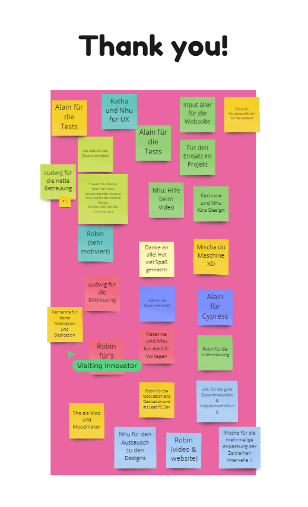

# Meeting Protokoll

## 11/12.10.2021 Kick-off mit Ludwig (Data Science Experte von Exxeta)

### Meeting Information
**Datum/Zeit:** 11/12.10.21, 14-15 Uhr
**Grund:** Kick-Off 

### Diskussions Items
- Einführung in das iBKM Projekt

## 15.10.2021 UX Session mit Daniel (UX Experte von Exxeta)

### Meeting Information
**Datum/Zeit:** 15.10.21, 11-12 Uhr
**Grund:** UX Vorgehen besprechen und Interview Leitfaden

### Duskussions Items
- Besprechung des UX Vorgehen
- Interview Leitfaden Vorgehen

## 21.10.2021 Internes Gruppenmeeting

### Meeting Information
**Datum/Zeit:** 21.10.21, 12:30-15:00 Uhr
**Grund:** Allgemeine Planung, Vorbereitung für das Interview

### Diskussion Items
#### Tech Stack
Zum Voting standen folgende Frontend Technologien zur Auswahl (die meisten Votes in Fett markiert):
- VueJS
- Angular
- **React (ggf. React Native)**
- **Tailwind CSS**
- Bootstrap
- Nivo Rocks React Component Lib
- **Cypress**

UI & UX:
- Adboe XS
- **Figma**
- **Miro**

#### Rollenverteilung innerhalb des Teams
- Robin übernimmt vorerst die Rolle als Frontend Lead
- The-Anh übernimmt das Projektmanagament und Alain unterstützt ihn
- Nhu und Katharina sind UI & UX Lead
- Bach und Mischa sind verantwortlich für das Serverless Backend

#### Interviewvorbereitung
- Nhu und Katharina entwarfen das Interviewskript in einem privaten Meeting
- Dieser Interviewleitfaden wurde in der ganzen Gruppe besprochen
- Interviewer:in Katharina und The-Anh
- Notetaker: der Rest

#### Festlegung Tools
- Google Drive, Miro, Jira, Gitlab (Github als öffentliches Repo)
- Nhu wird die Github Organisation erstellen

#### Andere Notizen
- Zunächst Mobile-first Ansatz

### Action Items 
| Wer | Action Item |
| ---- | ---- |
| Backend Team | Research zu Amazon Lambdas und Serverless Architectur |

## 22.10.2021 Jour Fix (mit Exxeta)

### Meeting Information
**Datum/Zeit:** 22.10.21, 11-12 Uhr
**Grund:** Sync Up

### Diskussion Items
#### Tech Stack Auswahl
- ist soweit in Ordnung
- Alternativen zu Nivo Rocks prüfen
- Vorschlag von Exxeta: Recharts https://recharts.org/en-US/

#### Besprechung des Interviewleitfadens
- Fragen sind soweit gut
- Zusätzliche Frage aufnehmen: "Können wir sie bei weitern Fragen kontaktieren?"

#### Einführung in Scrum mit Gerrit (Exxeta)
- How to task: Wer möchte was wofür?
- User Stories nicht zu technisch formulieren

#### Andere Notizen
- Abgleich mit Ludwig (Exxeta)
- Weiter Libraries, die wir rausgesucht haben im Anschluss:
  - https://www.tabnine.com/blog/top-11-react-chart-libraries/
  - https://airbnb.io/visx/gallery (React chart component library von Airbnb (D3, React), Charts sehen alle richtig fancy aus)
  - https://github.com/rrag/react-stockcharts, https://www.npmjs.com/package/react-financial-charts (gut fuer die Darstellung von Aktien)
  - https://www.npmjs.com/package/recharts (Hier is der Mix aus Fancyness und Funktionalität ggf am besten? + Well maintained

## 27.10.2021 Sync up zum Projekt (mit Ludwig von Exxeta)

### Meeting Information
**Datum/Zeit:** 27.10.21, 16:30-17:30 Uhr
**Grund:** Mehr Informationen zum Projekt, Daten und Scrum

### Diskussion Items
#### Vorgehensweise
- Mock Backend (Spaeter Serverless ..)
- Beispieldaten zunächst ins Repo

#### Daten
- Ludwig gibt uns drei CSV Dateien zur Verfügung
- UI Darstellung von: Prediction & Ground Truth in der Vergangenheit
  - Login Page => Auswahl Bilanzkreis => Einsehen der Zeitreihen

#### Notizen
- Wir stellen aggregierte Werte und Graphen sowie die Prognosen bereit
- In Form einer Art Landingpage
- Erstes Epic soll eine Darstellung der Prognosedaten mit React sein
- How to parse CSV to JSON https://www.npmjs.com/package/react-papaparse
- AWS Cognito als Usermanagement System
- Anschauen um CI/CD Workflow aufzusetzen https://aws.amazon.com/de/amplify/, https://aws.amazon.com/de/getting-started/hands-on/deploy-react-app-cicd-amplify/
- CSV Datei
  - Welcher dieser Werte beeinflusst die Prediction an einem Zeitpunkt am meisten?
  - Vorhersage Größe (Beispiel = Einspeisung)
  - Zeitreihen für einen Tag in der Zukunft (x-Achse)
  - Params: Tag (daily_sin), Woche (weekly_cos) => Intercept?
  - Prediction (der Einspeisung) y-Achse, Zeit x-Achse
  - Wahrheit (ground truth) Wert haben wir nur wenn wir in die Vergangenheit schauen
  - Prediction Intervalle(je 15 min)
  - Gesamte Netzlast (Modifiziert)

## 28.10.2021 Interviewauswertung (Internes Gruppenmeeting)

### Meeting Information
**Datum/Zeit:** 28.10.21, 12:30-15:00 Uhr
**Grund:** Auswertung der Interviewnotizen

## 03.11.2021 Serverless Backend mit Ludwig (von Exxeta)

### Meeting Information
**Datum/Zeit:** 28.10.21, 16:30-17:30
**Grund:** Einführungs ins Serverless Backend

### Diskussion Items
#### Serverless Backend
- https://docs.aws.amazon.com/lambda/latest/dg/nodejs-handler.html
- https://www.serverless.com/
- https://www.freecodecamp.org/news/build-an-api-with-typescript-and-aws/
- https://aws.amazon.com/de/cognito/
- https://docs.aws.amazon.com/code-samples/latest/catalog/code-catalog-typescript.html
- https://docs.aws.amazon.com/AWSJavaScriptSDK/latest/
- AWS Cognito als Usermanagement System
- Kostenlosen S3 Folder einrichten => Kostenlose Lambda Funktion einrichten, welche den S3 Folder mit den CSV File ausliest
- S3 hostet unsere Applikation

### Action Items
| Wer | Action Item |
| ---- | ---- |
| Ludwig | Er erstellt uns einen AWS Account |

## 05.11.2021 Jour Fix (mit Exxeta)

### Meeting Information
**Datum/Zeit:** 05.11.21, 11-12 Uhr
**Grund:** Sync Up

### Diskussion Items
#### Vorstellung des Low Fidility Design
- Feedback von Daniel (UX Experte von Exxeta) und Micha (Frondend Dev von Exxeta) erhalten
- Notizen im Figma

### Action Items
| Wer | Action Item |
| ---- | ---- |
| Team | React App soll in das S3 Bucket deployed werden |
| Team | Ludwig fragen wegen Nutzung von Amplify |
| Ludwig | Rechte für HTW Nutzer hinzufügen |

## 10.11.2021 Diskurs Daten mit Ludwig (von Exxeta)

### Meeting Information
**Datum/Zeit:** 10.11.21, 16:30-17:30
**Grund:** Detaillierte Besprechung der Daten

### Diskussion Items
#### Daten
- Maschine Learning Modell gibt Ground Truth aus
- Welcher Parameter hat welchen Beitrag zur Ground Truth
- Absolute Werte nehmen und aufaddieren (Summe Features)

### Action Items
| Wer | Action Item |
| ---- | ---- |
| Team | Schätzen von User Stories für den nächsten Sprint |
| Team | Voerst einen Bilanzkreis anzeigen (Rapid Prototyping) |
| UI&UX Team | Für das Hi-Fi prototyping ein Wireframe Kit verwenden |

## 12.11.2021 Jour Fix (mit Exxeta)

### Meeting Information
**Datum/Zeit:** 12.11.21, 11-12 Uhr
**Grund:** Sync Up

### Diskussion Items
#### Rapid Prototyping
- Funktionalitäten, Rudimentäre Strukturen für den Flow um auf bestimmte Seiten zu kommen
- Später: Verfeinerungen, Optimierungen

## 19.11.2021 Jour Fix (mit Exxeta)

### Meeting Information
**Datum/Zeit:** 19.11.21, 11-12 Uhr
**Grund:** Sync Up

### Diskussion Items
- Vorstellung der Lambdafunktion
- Es soll nicht auf Design gewartet werden
- HTML Gerüst parallel anfangen

## 26.11.2021 Jour Fix (mit Exxeta) & interne Retroperspektive (ohne Exxeta)

### Meeting Information
**Datum/Zeit:** 26.11.21, 11-12 Uhr
**Grund:** Sync Up und im Anschluss erste interne Retroperspektive

### Diskussion Items
- Sprintfeedback
- Reviews
- Wir möchten die interne Kommunikation verbessern
- Sprint Refinement

### Action Items (resultierend aus der Retroperspektive)
| Wer | Action Item |
| ---- | ---- |
| Team | Kleinere User Stories sollen erstellt werden |
| Team | Meeting am Donnerstag soll jede Woche sattfinden. Auch nutzen für Retro und Refinement |
| Team | Kommunizieren wann ein Tickets in Progress geschoben wird, sodass jeder weiß an was man sitzt |
| Team | Bessere Kommunikation über Arbeitsfortschritt (besonders vor dem JourFix) |
| Team | Functional Review der Tickets mit Design-Umsetzungen machen Designer |
| Team | User Stories nur in Absprache in den Sprint packen |

## 03.12.2021 Jour Fix (mit Exxeta)

### Meeting Information
**Datum/Zeit:** 03.12.21, 11-12 Uhr
**Grund:** Sync Up

### Diskussion Items
- Feedback von Exxeta
- Besprechung fertiger Tickets
- Besprechung der nächsten Schritte

#### Besprechung der letzten Retroperspektive
- Wie können wir bessere Kommunikation besser messen?
- Was sind die genauen Schritte um die im Retro festgelegten Ziele zu erreichen?
- Gezielte Aktionen definieren und Aufgaben zuweisen, um die Ziele zu erreichen
- Gerrit (Scrum Master von Exxeta) hilft bei Moderation der nächsten Retroperspektive

## 10.12.2021 Jour Fix (mit Exxeta) & Retroperspektive

### Meeting Information
**Datum/Zeit:** 10.12.21, 11-12 Uhr
**Grund:** Sync Up & im Anschluss Retroperspektive modiert von Gerrit (Scrum Master von Exxeta)

### Diskussion Items
#### Feedback zum Graphen Design
- Steuerelemente: Filter kleiner sind okay => zwei verschiedene Grössen
- Farben für Graphen ändern für bessere Lesbarkeit
- Grösserer Tooltip ist OK
- Zeitreiheneinstellung mit gespeicherten Defaults bzw. wenn User Änderungen macht, dass diese abgespeichert werden und in jeder neuen Session gleich sind

#### Priorisierung von Features
- Der Graph ist das Hauptfeature und hat somit die höchste Prio
- Low: die anderen Widgets und Dateien
- Das Design Team soll parallel mit am Frontend aushelfen

#### Post-Jour-Fix
- Gedankenaustausch über die ausgwählten Technologien (Tailwind und Typescript)

## 06.01.2022 Internes Gruppenmeeting

### Meeting Information
**Datum/Zeit:** 06.01.22, 12:30-15:00 Uhr
**Grund:** Sync Up und gemeinsame Arbeitszeit

### Diskussion Items
- Gegenseitige Hilfe
- Sprintabschluss

#### MVP Besprechung
- Was soll der MVP können?
- Welche Features brauchen wir noch?
- Wo stehen wir gerade?

#### Showtime Planung
- Wer ist verantwortlich für Herrn Zhang? => The-Anh
- Wer geht zum Kickoff? => Alle die Zeit haben

## 07.01.2022 Jour Fix (mit Exxeta)

### Meeting Information
**Datum/Zeit:** 07.01.22, 11-12 Uhr
**Grund:** Sync Up

### Diskussions Item
- Stand im Kanban Board

## 13.01.2022 Internes Gruppenmeeting

### Meeting Information
**Datum/Zeit:** 13.01.22, 12:30-15:00 Uhr
**Grund:** Sync Up und gemeinsame Arbeitszeit

### Diskussion Items
- Sprintstatus

#### Showtime Planung
- Welche Features wollen wir noch umsetzen?
  - Persistierung von Files
  - Bilanzkreisauswahl beim Login

## 14.01.2022 Jour Fix (mit Exxeta)

### Meeting Information
**Datum/Zeit:** 14.01.22, 11-12 Uhr
**Grund:** Sync Up

### Diskussions Item
- Stand im Kanban Board

## 20.01.2022 Internes Gruppenmeeting

### Meeting Information
**Datum/Zeit:** 20.01.22, 12:30-15:00 Uhr
**Grund:** Sync Up und gemeinsame Arbeitszeit

### Diskussion Items
- Sprintstatus

#### Showtime Planung
- Wer macht was?
- Abrpache bezüglich der Showtime Webseite
- Sammlung von Inhalten

#### Sprint Planung
- Welche Features wollen wir noch umsetzen?
- Aktuelle Probleme
- Bugs
- Wer macht was?

## 21.01.2022 User Testing mit einem zukünftigen Nutzer

### Meeting Information
**Datum/Zeit:** 28.01.22, 11-12 Uhr
**Grund:** User Testing, Thinking Aloud Session

## 28.01.2022 Jour Fix (mit Exxeta)

### Meeting Information
**Datum/Zeit:** 28.01.22, 11-12 Uhr
**Grund:** Sync Up

### Diskussion Items
- Kanban Board
- Vorstellung vom abschliessenden User Testing

#### Feedback von Daniel zum High Fidility Design
- Logo mit neuem Exxeta Logo ändern
- FavIcon ändern
- Passwort Vergessen, Registrieren etc prominenter gestalten
- Nach Registrierung: nicht Zurück zum Login sondern Zum Login
- Legende: Checkbox direkt schon mit in die Legende und sich Modal sparen
- PNG: Padding hinzufügen
- Open in new Tab: ggfs. direkt im gleichen Tab
- Open in new Tab: Filter einstellung dort: Auch im Dashboard uebernehmen

## 28.01.2022 Austausch mit Elena bzgl. der Video Präsentation (von Exxeta)

### Meeting Information
**Datum/Zeit:** 28.01.22, 13-14 Uhr
**Grund:** Anfrage zur Hilfe bei unserer Video Präsentation

### Diskussion Items
- Feedback und Verbesserungsvorschläge zum Skript
- Tipps und Tricks für die Videoaufnahme und Bearbeitung

## 04.02.2022 Jour Fix & Retroperspektive (mit Exxeta)

### Meeting Information
**Datum/Zeit:** 04.02.22, 11-12 Uhr
**Grund:** Sync Up und & abschliessende Retroperspektive zusammen mit Exxeta

### Diskussions Item
- Stand im Kanban Board

#### Retroperspektive
- Moderiert von Gerit (Scrum Master von Exxeta)
- Letzter Teil der Retroperspektive im Miro - Danksagung

